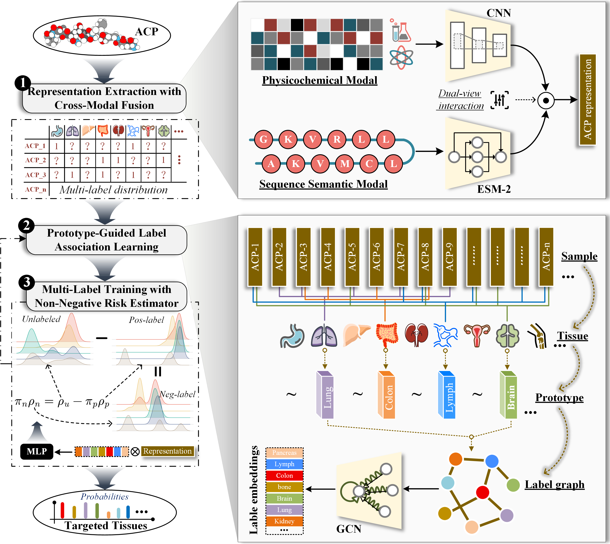

# ATfinder

ATfinder is a frozen multi-label ACP ranking model package for **five-fold independent evaluation**.  
This repository provides the **model implementation**, **prepared dataset**, and **frozen checkpoints** used in the released experimental setting.

<p align="center">
  
</p>

<p align="center">
  <em>Figure 1. Overall architecture and workflow of ATfinder.</em>
</p>

---

## Overview

This package is intended for **reproducible evaluation** of the ATfinder framework under a fixed experimental configuration.

It includes:

- the complete **ATfinder model code**
- the prepared **multi-label ACP dataset**
- **five-fold frozen checkpoints**
- the training/evaluation entry point under the released setting

The current release is designed for **five-fold independent ACP multi-label ranking**, rather than for arbitrary reconfiguration.

---

## Repository Structure

```text
ATfinder/
├── ours/                  # ATfinder model, losses, metrics, and trainer
├── train.py               # Single entry point for the frozen configuration
├── data/                  # Sequences, labels, splits, masks, ESM-2 cache, AAindex table
├── models/
│   ├── fold_1/            # Frozen checkpoint for fold 1
│   ├── fold_2/            # Frozen checkpoint for fold 2
│   ├── fold_3/            # Frozen checkpoint for fold 3
│   ├── fold_4/            # Frozen checkpoint for fold 4
│   └── fold_5/            # Frozen checkpoint for fold 5
└── assets/
    └── acp.png            # Model architecture / workflow figure
```

---

## Frozen Experimental Configuration

The released ATfinder setting uses the following fixed configuration:

- **12 cancer-type labels**
- **Random-initialized downstream network** with **fixed pretrained ESM-2 cache**
- **ESM + physicochemical CNN** with **interaction fusion**
- **Undirected weighted top-3 label co-occurrence GCN**
- **nnPU + Deficit-TopK + PPG observed-positive auxiliary loss**
  - auxiliary loss weight: **0.1**
- **Checkpoint selection criterion**:
  - `0.3 * CV F1@3`
  - `0.3 * CV F1@5`
  - `0.4 * CV Macro Recall@0.5`
- **Independent evaluation after CV-based checkpoint selection**

---

## Installation

Install dependencies with:

```bash
pip install -r requirements.txt
```

---

## Training / Evaluation

Run the released configuration with:

```bash
python train.py --output runs/atfinder --device cuda
```

### Arguments

- `--output`: directory to save logs and outputs
- `--device`: computation device, e.g. `cuda` or `cpu`

> Note: this repository is distributed in a **frozen configuration**.  
> The main purpose is to reproduce the released five-fold evaluation setting.

---

## Data

The prepared dataset is located in:

```text
data/
```

It contains:

- peptide sequences
- multi-label annotations
- fold splits
- loss masks
- fixed ESM-2 cache
- AAindex physicochemical feature table

For additional details, please refer to:

```text
data/README.md
```

---

## Frozen Checkpoints

Frozen checkpoints for the five folds are provided in:

```text
models/fold_1
models/fold_2
models/fold_3
models/fold_4
models/fold_5
```

These checkpoints correspond to the released training configuration described above.

---

## Notes

- This package focuses on **reproducibility** of the released ATfinder setting.
- The included configuration, dataset organization, and checkpoints are intended for **independent five-fold evaluation**.
- If you plan to modify the architecture or training pipeline, please treat this repository as a **frozen reference implementation**.

---

## Citation

If you use this repository in your work, please cite the corresponding paper or project release if applicable.
